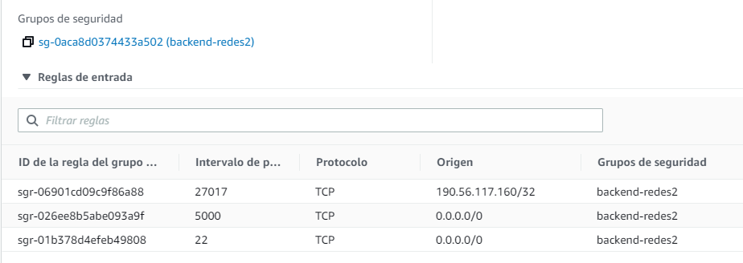

<p style="font-size: 18px">
Universidad de San Carlos de Guatemala
<br>
Facultad de Ingeniería
<br>
Escuela de Ciencias y Sistemas
<br>
Redes de Computadoras 2
<br>
Ing. Manuel Fernando Lopez
<br>
Aux. Edgar Cil 
<br>
Aux. Randy Can
</p>

<br><br><br><br>

<h1 align="center" style="font-size: 40px; font-weight: bold;">Proyecto</h1>

<br><br><br>

<div align="center">

|  Carnet   |            Nombre            |
| :-------: | :--------------------------: |
| 201700965 | José Carlos I Alonzo Colocho |
| 201700319 | Estanley Rafael Cóbar García |
| 201709140 | Oscar Armin Crisostomo Ruiz  |

</div>

<br><br>

<h4 align="center" style="font-size: 18px; font-weight: bold;">Guatemala 2022</h4>

---

<br><br><br><br>


<h1 align="center" style="font-size: 40px; font-weight: bold;">Manual Técnico</h1>

<br><br><br>

<div align="center">

|  Carnet   |             Nombre              |
| :-------: | :-----------------------------: |
| 201700319 |  Estanley Rafael Cóbar García   |
| 201700965 |  José Carlos I Alonzo Colocho   |
| 201709140 |   Oscar Armin Crisostomo Ruiz   |

</div>

<br><br>

<h4 align="center" style="font-size: 18px; font-weight: bold;">Guatemala 2022</h4>

---

<br><br>

<h1>Tabla de Contenido</h1>

- [**1. Arquitectura**](#1-arquitectura)
- [**2. Base de datos**](#2-base-de-datos)
- [**3. Balancer**](#3-balancer)
- [**4. Router**](#4-router)
- [**5. Servidores**](#5-servidores)
- [**6. Seguridad**](#6-seguridad)

<br><br>

---

# **1. Arquitectura**

El diseño y arquitectura de la infraestructura de nuesta pagina web es vital para el uso de los usuarios para su adquisicion demostrando de forma clara en la pagina exponiendo de forma clara las nuevas tecnologías que benefician al país. Desarrollandola en AWS con dos servidores de react (fontend) y un unico servidor(backend).  

<div align="center">


</div>

<p align="center" style="font-size: 15px; font-style: italic; ">Imagen 1 Arquitectura.</p>

<br>

---

# **2. Base de datos**

Para una facil accesibilidad a los datos se opto por MongoDB por el diseño no cuenta con muchas colecciones.

```json
//coleccion images
{
    "url"   : string,
    "nombre": string 
}

//coleccion developers
{
    "nombre": string,
    "carnet": string,
    "curso" : string,
    "puesto": string,
    "imagen": string
}

//coleccion administrators
{
    "nombre"     : string,
    "descripcion": string,
    "puesto"     : string,
    "imagen"     : string 
}
```
<br>

---

# **3. Balancer**

El balanceador de carga (Load balancer) es de suma importancia para el uso ideal y apropiado adpatandose a la cantidad de usuario necesaria para no tener inconveniente en caso de problemas en alguns servidor. Teniendo la siguiente configuracion. 

<div align="center">


</div>

<p align="center" style="font-size: 15px; font-style: italic; ">Imagen 2 Balancer.</p>

<br>

Asi mismo se tiene que tener un puerto a la escucha para el uso correcto de las paginas web por lo que se tiene la siguente escucha (Imagen 3) con los siguientes targets para mayor seguridad (Imagen 4)

<div align="center">


</div>

<p align="center" style="font-size: 15px; font-style: italic; ">Imagen 3 Escuchas.</p>

<br>


Asi mismo se tiene que tener un puerto a la escucha para el uso correcto de las paginas web por lo que se tiene la siguente escucha (Imagen 3) con los siguientes targets para mayor seguridad (Imagen 4)

<div align="center">


</div>

<p align="center" style="font-size: 15px; font-style: italic; ">Imagen 4 Targets.</p>

<br>

---

# **4. Router**

Para el dominio y su facil accesibilidad se tiene configurado de la siguiente manera el router y el router 53 correspondiente

<div align="center">


</div>

<p align="center" style="font-size: 15px; font-style: italic; ">Imagen 5 Configuracion Router.</p>

<br>

<div align="center">


</div>

<p align="center" style="font-size: 15px; font-style: italic; ">Imagen 6 Router53.</p>

<br>

---

# **5. Servidores**

Siguiendo el diseño e infraestructura ya definica se crearon dos servidores para el frontend teniendo dos instancias EC2 alojando las respectivas aplicaciones de react y la tercera instancia el backend realizado con NodeJs

<div align="center">


</div>

<p align="center" style="font-size: 15px; font-style: italic; ">Imagen 7 Instancias</p>

<br>

# **5. Seguridad**

Al ser una red para un pais completo se tiene que tener las medidas necesarias en la pagina web ya que pueden acceder y vulnerar el resto de servicios ofrecidos por lo cual se tienen las siguientes reglas de firewall para brindar la seguridad necesaria

<br>

<div align="center">



</div>

<p align="center" style="font-size: 15px; font-style: italic; ">Imagen 8 Firewall Backend</p>

<br>


<div align="center">


</div>

<p align="center" style="font-size: 15px; font-style: italic; ">Imagen 9 Firewall Frontend</p>

<br>
